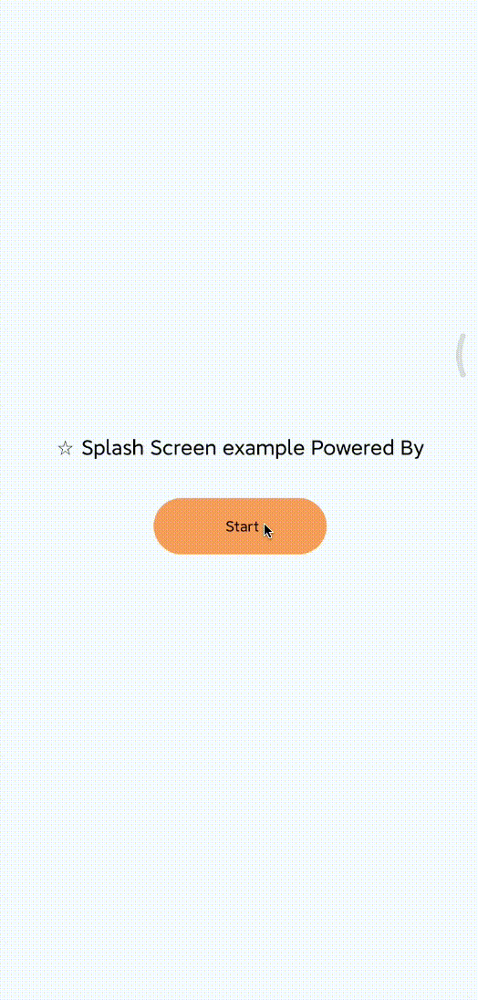
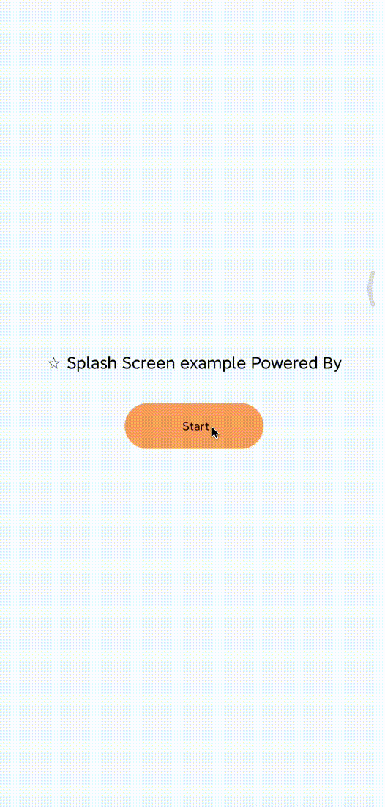

# 开屏（Splash）广告启动动画配置

> **注意：该配置目前仅限于在 react-native-ad 1.1.4 版本且 Android 环境下有效**

示例代码：

```
ad.startSplash({
    appid: '',
    codeid: '',
    anim: 'default',
});
```

| 值       | 描述             | 效果图                                                                                                             |
| -------- | ---------------- | ------------------------------------------------------------------------------------------------------------------ |
| default  | 系统默认动画     | 系统默认 Activity 切换效果                                                                                         |
| none     | 没有动画效果     | [](./assets/ad_anim_none.gif)             |
| fade     | 淡入淡出动画效果 | [](./assets/ad_anim_fade.gif)             |
| slide    | 幻灯片动画效果   | [](./assets/ad_anim_slide.gif)          |
| catalyst | 向上推入动画效果 | [](./assets/ad_anim_catalyst.gif) |
